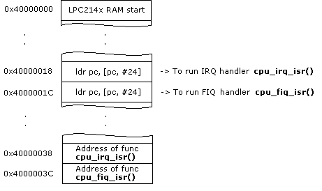
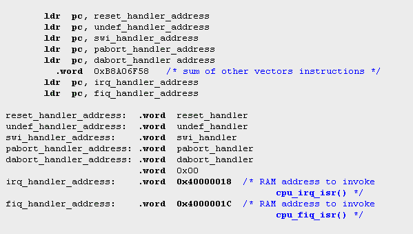
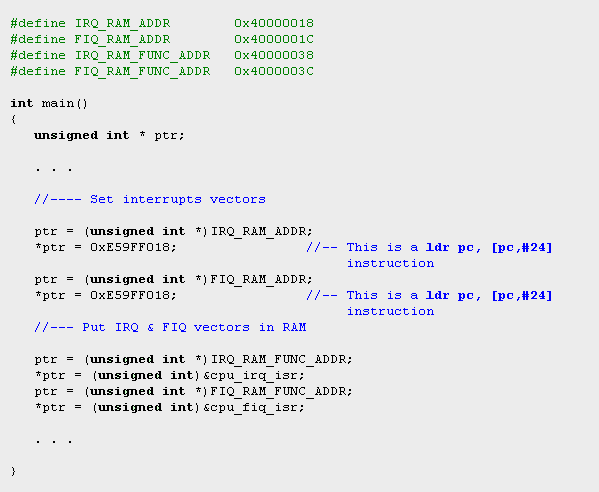
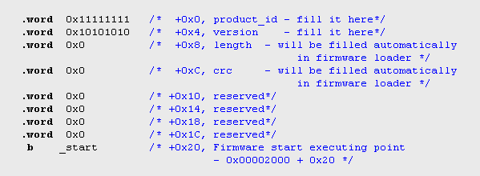
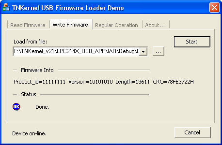

## USB Firmware Upgrader

## Description

  The USB Firmware Upgrader is a standalone program for the Philips LPC214x  microcontroller, which allows to download the firmware  (an application program) to the microcontroller's flash using an USB.
  This is very useable for the field/customer future firmware upgrades.

**1\. Firmware Upgrader program**

  The Firmware Upgrader is placed into the FLASH at an address  range 0x0000000 - 0x00001FFF (8 KBytes).
 After the hardware reset, the device always starts with the Firmware Upgrader.
 The Firmware Upgrader performs 3 base functions: 
     - startup 
     - read firmware from FLASH 
     - write firmware to FLASH 

 The Firmware Upgrader program's source code is placed  in the directory /LPC214X_USB_FWU.

    **1.1 Firmware Upgrader startup**

  After a  hardware reset, the Firmware Upgrader checks  a request (mark) from the firmware to operate (read/write firmware)  - the request is defined as a value 0x12345678 at the address 0x40000000  and a value 0x43211234 at the address 0x40000004 in the RAM. 
   If a request does not exists, the Firmware Upgrader checks a firmware crc and length. 
   If a crc is o.k. and a firmware size is valid, the firmware  is started and the Firmware Upgrader is terminated.  Otherwise, the Firmware Upgrader works as a standalone program.

    **1.2 Read firmware from FLASH**

   The host software sends a request (the Control EP0 Vendor Class Request is used)  to obtain a firmware information - product_id, version, length (size), crc.  
   The data part of the request is used to transfer an information to the Host. 
   Then the Host software sends a request to read  the firmware (the Control EP0 Vendor Class Request is used). 
   The device sends the firmware by the IN Bulk Endpoint EP2 (0x02).  A data transfer unit has the size 4096 bytes. 
   If a crc is o.k. and the firmware size is valid, the  firmware is started and the Firmware Upgrader is terminated. Otherwise,  the Firmware Upgrader works as a standalone program.

    **1.3 Write firmware to FLASH**

  The Host software sends a firmware information  (product_id, version, length (size), crc) to the device by the Control  EP0 Vendor Class Request. A data part of request is used to transfer  an information. 
   Then the device performs an erasing of the flash sectors according to  the firmware length (size) and sends a message to the Host about the  flash ready to write. The IN Bulk Endpoint EP2 (0x02) is uses for this purpose. 
   The Host sends a firmware to the device by the OUT Bulk  Endpoint EP2 (0x82). A data transfer unit has the  size 4096 bytes.  When a first firmware's unit is received (it starts at address  0x00002000 in the Flash), then a firmware info is placed at the  beginning of the RAM reception buffer to be stored in the FLASH  at the address range 0x00002000 - 0x0000200F. 
   After the end of firmware's writing, the Firmware Loader checks  a firmware's crc and sends the results of checking to the Host by  the IN Bulk Endpoint EP2 (0x02). 
   If a crc is o.k, the firmware is started and the Firmware  Upgrader is terminated. Otherwise, the Firmware Upgrader works as a standalone program.

    **1.4 Interrupts vectors sharing**

   An interrupt vectors are placed in the Flash. To share the Interrupt  vectors between the Firmware Upgrader and a firmware (the user application)  programs, the addresses of the interrupt handlers are placed at  the reserved RAM locations:

  This is a part of the Firmware Upgrader's source code that handles  the interrupts vectors (at the start address 0x00000000):

This is a part of source code to place interrupts vectors in RAM:

    **1.5 LPC214x Code Read Protection**

   A code read protection is enabled by the programming the flash  address location 0x1FC (User flash sector 0) with a value 0x87654321. 
   The Firmware Upgrader has a special variable _flash_pcell_  in the separate code segment _.flashprot_. A linker script  defines this segment location at the address 0x1FC in the Flash. 
   The Firmware Upgrader uses the Philips LPC21XX internal  IAP commands to erase/write flash. It allows download a firmware by the USB when a Code Read Protection is turned on and the JTAG operations are forbidden. 
   In the Firmware Upgrader's source code, a Code  Read Protection is turned off for the debugging purposes.

**2\. Firmware (the user application) program**

  A Firmware program is placed in the FLASH at the start  address 0x00002000.
  The address range 0x00002000 - 0x0000201C  is reserved for  the information about a firmware, the start executing address of the  firmware is 0x00002020:

<table cellpadding="0" cellspacing="0" border="0" id="table" class="sortable">

<tbody>

<tr>

<td bgcolor="#F0F0F0" align="center">Name</td>

<td bgcolor="#F0F0F0" align="center">Field Length (bytes)</td>

<td bgcolor="#F0F0F0" align="center">Flash Location Address</td>

</tr>

<tr>

<td align="center">product id</td>

<td align="center">4</td>

<td align="center">0x00002000</td>

</tr>

<tr>

<td align="center">version</td>

<td align="center">4</td>

<td align="center">0x00002004</td>

</tr>

<tr>

<td align="center">length(size)</td>

<td align="center">4</td>

<td align="center">0x00002008</td>

</tr>

<tr>

<td align="center">crc (CRC32)</td>

<td align="center">4</td>

<td align="center">0x0000200C</td>

</tr>

</tbody>

</table>

This is a part of the firmware startup code (this fragment is placed  in the FLASH at the start location 0x00002000):

   There are two firmware parameters which should be defined in  the user source code - product_id and version. A firmware length and  crc will be calculated automatically by the PC program at the writing  firmware operation.

    A firmware program performs the switching to the Firmware  Upgrader after the Host request (the Control EP0 Vendor Class Request  is used for this purpose). 
    A switching to the Firmware Upgrader has two stages: 
    - setting the mark to the Firmware  Upgrader about the firmware's request (a writing  the value 0x12345678  at the address 0x40000000 and the value 0x43211234 at the address  0x40000004 in the RAM). 
    - a hardware reset by the watchdog.

   The TNKernel USB firmware example is placed  in the directory /LPC214X_USB_APP. This example shows all the firmware  program's specific stuffs (see above) and also performs (as payload)  the sending data to the Host by the IN Endpoint EP2(0x82).

    **2.1\. Firmware debugging**

    To debug a firmware, the Firmware  Upgrader program should be loaded in the FLASH.    In this case, the Firmware Upgrader after a hardware  initialization must immediately starts a firmware and terminates. 
    For this purpose, in the file  _fwu.c_ (the Firmware Upgrader's source code) this line  should be uncommented:

    When the RUN_FW_ALWAYS is defined,  after the reset the Firmware Upgrader does not checks a firmware request  and a firmware presence (crc & length) - the Firmware Upgrader makes  the hardware initialization and immediately finishes the work  (and the firmware will start).

**3\. USB VID and PID**

   The firmware and the Firmware Upgrader should have a different  USB PID. In this examples, 
  - a dummy VID = 1237(hex) and PID = 1BCD(hex) are used for  the Firmware Upgrader (see the file _tn_usb_descr.c_ in the  directory /usb_fwu). 
  - a dummy VID = 1237(hex) and PID = ABCD(hex) are used for  the firmware (see the file _tn_usb_descr.c_  in the directory /usb_app). 

**4\. Firmware Loader Demo (PC application)**

    The Firmware Loader Demo is a PC application for the Microsoft Windows (c).

   Before using this program:

    - The Firmware Upgrader (_fwu_) must be placed  into the Philips LPC214x microprocessor by an any suitable  debugger/flash writer. 
    - The device should be coupled to the Thesycon(r)  USB demo driver (see a Chapter 5 in the  _USB Bulk Firmware_ description). 
    - Then the user should download the firmware example  (_usb_app_) into the device (a tab "_Write Firmware_") and  couple the example with Thesycon(r) USB demo driver. 

   After that, the program is ready for the regular operation  by the firmware (a tab "_Regular Operation_") or to read a firmware  by the switching to the Firmware Upgrader (a tab "_Read Firmware_"). 
   When the program is switched from the firmware to  the Firmware Upgrader and back (for the firmware reading/writing),  the automatic USB reconnection occurs (you can see it as a messages  blinking in the USB status line).

## License

<table cellpadding="0" cellspacing="0" border="0" id="table1" class="sortable">

<tbody>

<tr>

<td>BSD</td>

</tr>

</tbody>

</table>

© 2005, 2017 **Yuri Tiomkin**

